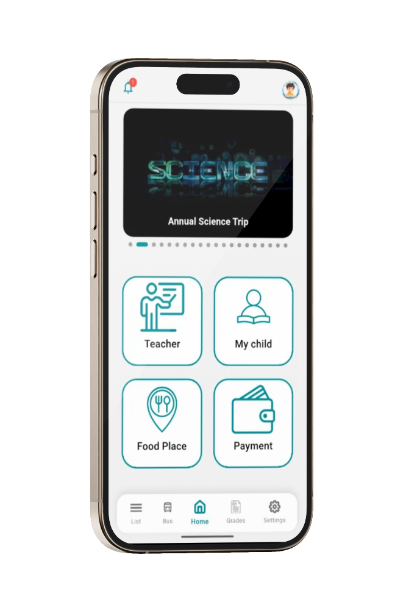
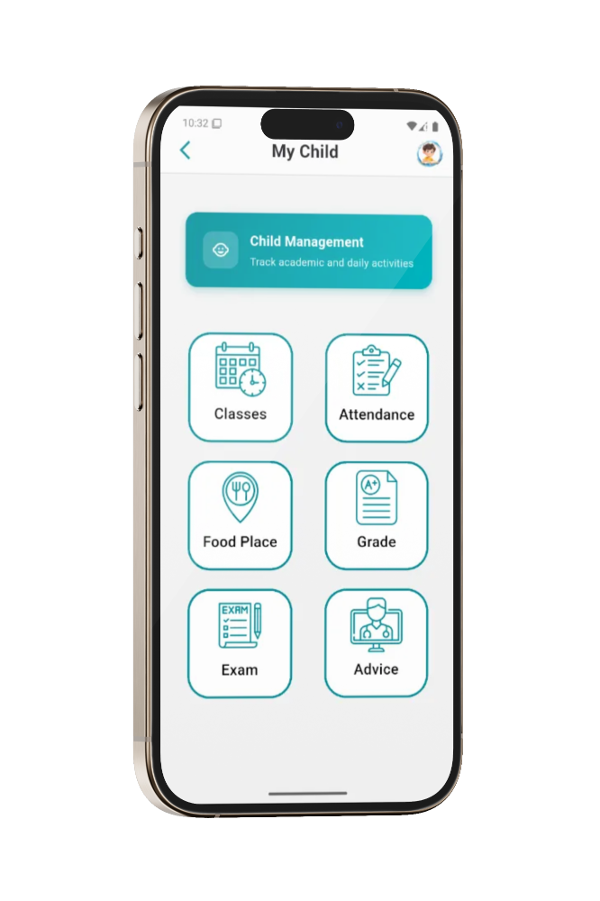
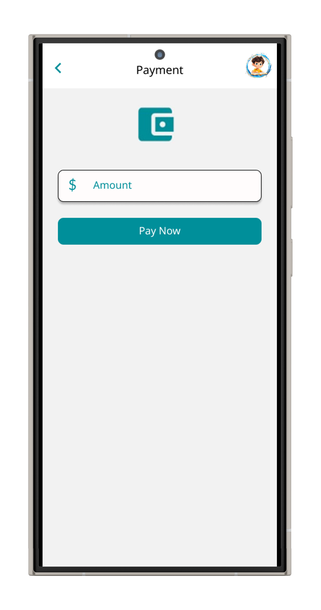
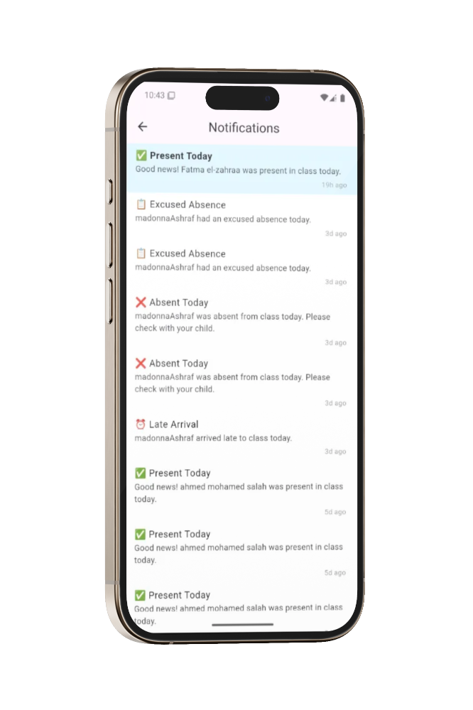
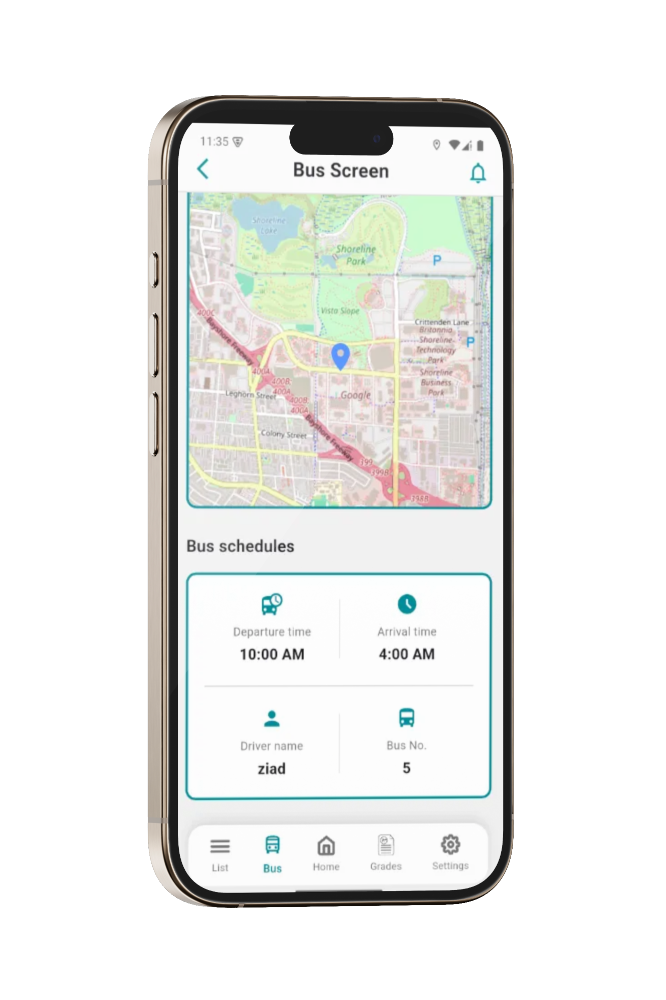
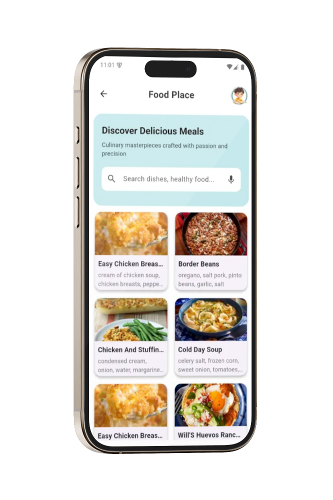
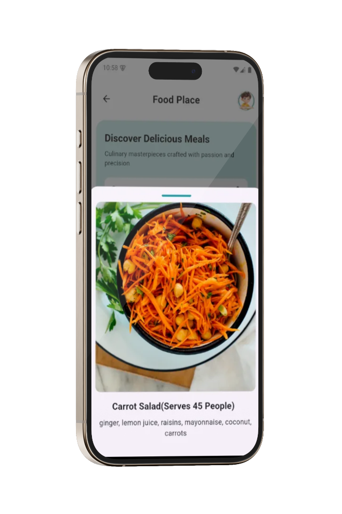
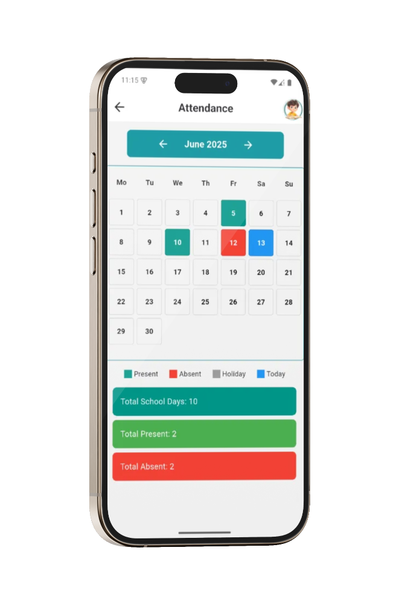

# 🎓 EduNourish
### Advanced Education & Student Nutrition Management System

<div align="center">


*A comprehensive mobile solution for modern educational institutions*

</div>

---

## 📋 Project Overview

EduNourish is a graduation project that combines educational management with student nutrition tracking in a single, intuitive mobile application. Built with Flutter, this app streamlines school operations while ensuring student well-being through comprehensive nutrition monitoring.

## ✨ Key Features

### 📊 **Academic Management**
- **Smart Attendance Tracking** - Real-time student attendance recording with automated notifications
- **Grade Management** - Comprehensive gradebook with performance analytics
- **Class Scheduling** - Interactive timetable with conflict detection and reminders

### 💳 **Payment Integration**
- **Secure Payments** - Seamless integration with Stripe site for school fees and meal payments


### 🔔 **Real-time Communication**
- **Socket.IO Notifications** - Instant updates for grades, announcements, and emergencies
- **Push Notifications** - Native mobile notifications for important events


### 🍽️ **Nutrition Management**
- **Digital Menu Display** - Interactive school cafeteria menu with nutritional information
- **Meal Planning** - Weekly meal schedules with dietary restriction considerations
- **Nutrition Tracking** - Calorie and nutrient monitoring for student health

### 🗺️ **Transportation & Location**
- **Flutter Map Integration** - Real-time bus tracking and route visualization
- **Driver Information** - Contact details and driver profiles
- **Schedule Management** - Departure/arrival times with live updates


### 📝 **Examination System**
- **Exam Scheduling** - Comprehensive exam calendar with conflict resolution
- **Result Management** - Instant grade publication and performance analytics
- **Study Resources** - Exam preparation materials and past papers

### 🧭 **Navigation**
- **Smart Bottom Navigation** - Intuitive app navigation using Smart Nav Bar
- **Quick Access** - One-tap access to frequently used features
- **Customizable Interface** - Personalized dashboard for different user roles

## 🛠️ Technical Stack

| Component | Technology |
|-----------|------------|
| **Frontend** | Flutter & Dart |
| **Backend** | Integration with NodeJs |
| **Real-time Communication** | Socket.IO |
| **Payment Processing** | Stripe API |
| **Maps & Location** | Flutter Map |
| **Navigation** | Smart Nav Bar |


## 🏗️ Architecture

The app follows **MVVM (Model-View-ViewModel)** architecture pattern with **Cubit** for state management, ensuring:
- **Separation of Concerns** - Clean code organization and maintainability
- **Reactive Programming** - Efficient state management and UI updates
- **Scalability** - Easy feature additions and modifications
- **Testability** - Comprehensive unit and widget testing capabilities

> 

## 🚀 Getting Started


### Installation

1. **Clone the repository**
```bash
git clone https://github.com/yourusername/edunourish.git
cd edunourish
```

2. **Install dependencies**
```bash
flutter pub get
```

3. **Run the application**
```bash
flutter run
```

<div align="center">
  <table>
    <tr>
      <td align="center">
        
        <br/>
        <sub><b>Home Screen</b></sub>
      </td>
      <td align="center">
        
        <br/>
        <sub><b>Student Screen</b></sub>
      </td>
      <td align="center">
        
        <br/>
        <sub><b>Payment</b></sub>
      </td>
    </tr>
    <tr>
      <td align="center">
        
        <br/>
        <sub><b>Notifications</b></sub>
      </td>
      <td align="center">
        
        <br/>
        <sub><b>Map View</b></sub>
      </td>
      <td align="center">
        
        <br/>
        <sub><b>Restaurant</b></sub>
      </td>
    </tr>
    <tr>
      <td align="center">
        
        <br/>
        <sub><b>Restaurant Details</b></sub>
      </td>
      <td align="center">
        
        <br/>
        <sub><b>Attendance</b></sub>
      </td>
      <td align="center">
        <!-- Empty cell for symmetry -->
      </td>
    </tr>
  </table>
</div>


## 🎥 Demo Video

<div align="center">
  
  <!-- Direct Link as Backup -->
  <a href="https://drive.google.com/file/d/1dxgNk7Xf7GfizStuzJg2UMOPEIL4Mqr4/view?usp=sharing">
    <strong>📱 Open in Google Drive (Full Screen)</strong>
  </a>
  
</div>


---

<div align="center">

**Made with ❤️ for modern education**

⭐ **Don't forget to star this repository if you found it helpful!** ⭐

</div>
