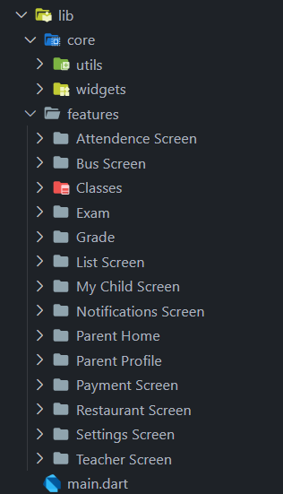

# 🎓 EduNourish
### Advanced Education & Student Nutrition Management System

<div align="center">


*A comprehensive mobile solution for modern educational institutions*

</div>

---

## 📋 Project Overview

EduNourish is a graduation project that combines educational management with student nutrition tracking in a single, intuitive mobile application. Built with Flutter, this app streamlines school operations while ensuring student well-being through comprehensive nutrition monitoring.

## ✨ Key Features

### 📊 **Academic Management**
- **Smart Attendance Tracking** - Real-time student attendance recording with automated notifications
- **Grade Management** - Comprehensive gradebook with performance analytics
- **Class Scheduling** - Interactive timetable with conflict detection and reminders

### 💳 **Payment Integration**
- **Secure Payments** - Seamless integration with Stripe site for school fees and meal payments


### 🔔 **Real-time Communication**
- **Socket.IO Notifications** - Instant updates for grades, announcements, and emergencies
- **Push Notifications** - Native mobile notifications for important events


### 🍽️ **Nutrition Management**
- **Digital Menu Display** - Interactive school cafeteria menu with nutritional information
- **Meal Planning** - Weekly meal schedules with dietary restriction considerations
- **Nutrition Tracking** - Calorie and nutrient monitoring for student health

### 🗺️ **Transportation & Location**
- **Flutter Map Integration** - Real-time bus tracking and route visualization
- **Driver Information** - Contact details and driver profiles
- **Schedule Management** - Departure/arrival times with live updates


### 📝 **Examination System**
- **Exam Scheduling** - Comprehensive exam calendar with conflict resolution
- **Result Management** - Instant grade publication and performance analytics
- **Study Resources** - Exam preparation materials and past papers

### 🧭 **Navigation**
- **Smart Bottom Navigation** - Intuitive app navigation using Smart Nav Bar
- **Quick Access** - One-tap access to frequently used features
- **Customizable Interface** - Personalized dashboard for different user roles

## 🛠️ Technical Stack

| Component | Technology |
|-----------|------------|
| **Frontend** | Flutter & Dart |
| **Backend** | Integration with NodeJs |
| **Real-time Communication** | Socket.IO |
| **Payment Processing** | Stripe API |
| **Maps & Location** | Flutter Map |
| **Navigation** | Smart Nav Bar |

## 🚀 Getting Started


### Installation

1. **Clone the repository**
```bash
git clone https://github.com/yourusername/edunourish.git
cd edunourish
```

2. **Install dependencies**
```bash
flutter pub get
```

3. **Run the application**
```bash
flutter run
```

## 📱 Screenshots

> 

## 🎥 Demo Video

> *Add your demo video here*


## 🤝 Contributing

We welcome contributions! Please see our [Contributing Guidelines](CONTRIBUTING.md) for details.

1. Fork the repository
2. Create your feature branch (`git checkout -b feature/AmazingFeature`)
3. Commit your changes (`git commit -m 'Add some AmazingFeature'`)
4. Push to the branch (`git push origin feature/AmazingFeature`)
5. Open a Pull Request

## 📄 License

This project is licensed under the MIT License - see the [LICENSE](LICENSE) file for details.

## 👥 Team

- **[Your Name]** - *Project Lead & Developer* - [@yourgithub](https://github.com/yourgithub)
- **[Team Member]** - *UI/UX Designer* - [@designer](https://github.com/designer)

## 🙏 Acknowledgments

- Flutter team for the amazing framework
- Firebase for backend services
- Stripe for payment processing
- All contributors and testers

## 📞 Support

If you have any questions or need help, please:
- Open an issue on GitHub
- Email us at: support@edunourish.com
- Join our Discord: [EduNourish Community](https://discord.gg/edunourish)

---

<div align="center">

**Made with ❤️ for modern education**

⭐ **Don't forget to star this repository if you found it helpful!** ⭐

</div>